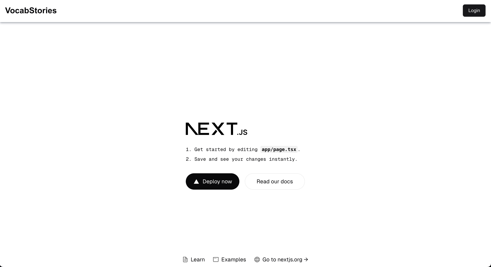

# Overview
This project is an basic auth template using supabase for auth, shadcn, nextjs, and typescript

# Installation
1. Create a Vercel project and link it to this project with `vercel link`.
2. Set up a supabase project, and put the NEXT_PUBLIC_SUPABASE_URL & NEXT_PUBLIC_SUPABASE_ANON_KEY in the .env.local file
3. Put these env vars in your vercel environment too. Then run `vercel env pull .env.local` to get all the right vars
4. Go to the [Auth templates](https://supabase.com/dashboard/project/_/auth/templates) page in your dashboard. In the Confirm signup template, change `{{ .ConfirmationURL }}` to `{{ .SiteURL }}/auth/confirm?token_hash={{ .TokenHash }}&type=signup&next=/dashboard`.
5. Run `npm install` to install all local packages
6. Run `npm run dev` to run the project in your local browser. 

Should work now and be deployable!

# Features
1. Default NextJS home page
2. Register page with email confirmation for user (will only work with Supabase organization members) that navigates back to protected /dashboard page
3. Login page

# Tech Stack
1. NextJS on Typescript for frontend
2. Supabase for auth
3. `shadcn/ui` for components
4. Lucide for icons

# Future development
1. Better error/validation on forms